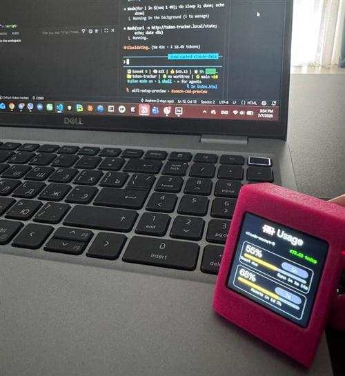
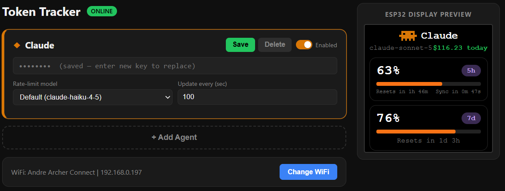

# ESP32 Token Tracker


An ESP32-C3 Super Mini device with a 1.54" ST7789 TFT display that tracks
AI token/credit usage across multiple providers — **Claude Code**,
**Cursor**, **Codex**, GPT/OpenAI, and DeepSeek — right on your desk.

WiFi is configured via a captive portal; you add agents and API keys through
a browser UI; the device polls provider APIs autonomously every 10 minutes
and shows live usage on its screen.

<p align="center">
  
  <br>
  
</p>

## Features

- 📶 **Captive-portal WiFi setup** — no hardcoded credentials, connect from
  any phone/laptop on first boot.
- 🖥️ **Web UI** — add/remove agents, paste API keys, pick a probe model,
  all from the browser (served directly off the device).
- 🔄 **Autonomous polling** — fetches usage every 10 minutes with no PC
  required, for providers that support an on-device API key.
- 📊 **Adaptive display** — shows whatever data is available: progress bar
  + token count, raw token count, or account balance.
- 🌉 **Companion bridge script** (`tools/usage-daemon.py`) for providers
  whose auth can't be typed into the device directly — Claude Code's local
  OAuth session and Codex CLI's local login — plus Cursor IDE's local token.
  The web UI generates the exact command to run (device IP, agent slot
  index) — just copy and paste. Its push interval is set live from the
  web UI's "Update every (sec)" field and re-read every cycle, so changing
  it takes effect without restarting the script.
- ⚠️ **Daemon-staleness warning** — if the companion script stops running,
  the device notices (no push within the expected interval) and shows
  "Start the daemon for fresh data" on both the TFT and web UI instead of
  silently going stale.

## Hardware

- ESP32-C3 Super Mini
- 1.54" ST7789 240×240 TFT display
- Pin mapping (see `platformio.ini`): SCLK=4, MOSI=6, CS=7, DC=2, RST=3, BL=8

## Wiring

4-wire SPI, write-only (no MISO needed). Pin numbers are ESP32-C3 GPIOs, as
defined in [`include/config.h`](include/config.h):

| ST7789 pin | ESP32-C3 pin | GPIO |
| ---------- | ------------ | ---- |
| VCC        | 3.3V         | —    |
| GND        | GND          | —    |
| SCL/SCLK   | GPIO4        | 4    |
| SDA/MOSI   | GPIO6        | 6    |
| CS         | GPIO7        | 7    |
| DC         | GPIO2        | 2    |
| RES/RST    | GPIO3        | 3    |
| BLK        | GPIO8        | 8    |

```
ESP32-C3 Super Mini              ST7789 1.54" TFT
┌─────────────────┐              ┌─────────────────┐
│           3.3V ──┼──────────────┼── VCC           │
│            GND ──┼──────────────┼── GND           │
│          GPIO4 ──┼──────────────┼── SCL (SCLK)    │
│          GPIO6 ──┼──────────────┼── SDA (MOSI)    │
│          GPIO7 ──┼──────────────┼── CS            │
│          GPIO2 ──┼──────────────┼── DC            │
│          GPIO3 ──┼──────────────┼── RES (RST)     │
│          GPIO8 ──┼──────────────┼── BLK           │
└─────────────────┘              └─────────────────┘
```

## Quick start

```bash
# Build firmware
pio run

# Build + upload to ESP32
pio run --target upload

# Upload web UI files (SPIFFS filesystem)
pio run --target uploadfs

# Build + upload + open serial monitor
pio run --target upload && pio device monitor
```

On first boot the device opens a WiFi setup portal — connect to it, pick
your network, and it reboots into the main web UI. From there, add an agent
per provider and paste an API key (where applicable).

For Claude Code / Codex / Cursor auto-sync via the companion PC script, see
[`tools/README.md`](tools/README.md).

## Testing

A Playwright suite covers the web dashboard and REST API, running against
either an auto-started mock (no hardware needed) or the real device. See
[`tests/README.md`](tests/README.md).

## Project layout

See [`CLAUDE.md`](CLAUDE.md) for the full architecture breakdown (firmware
modules, HTTP protocol, storage layout, display render logic).
